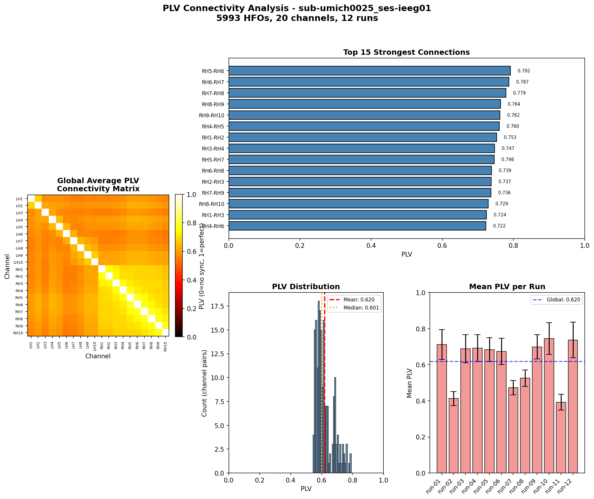
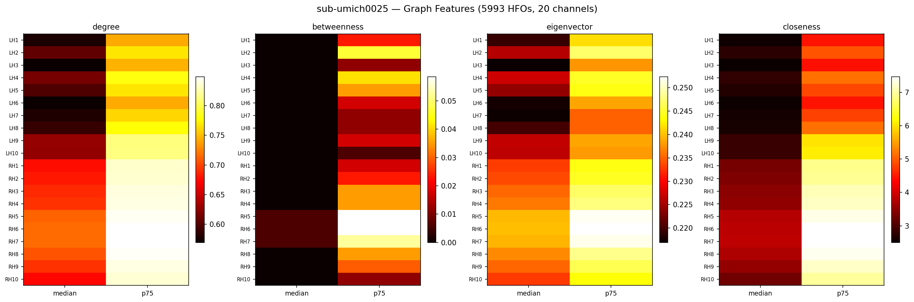

# HFO Phase-Locking Value (PLV) Analysis Pipeline

**Objective:** Measure functional connectivity during High-Frequency Oscillations (HFOs) in stereo-EEG (SEEG) recordings from epilepsy patients using Phase-Locking Value analysis.

## Background

HFOs (80-500 Hz) are biomarkers for epileptogenic zones. This pipeline computes PLV between SEEG channels during HFO events to understand how brain regions synchronize during these pathological oscillations.

## Pipeline Overview

| Step | Script | Description |
|------|--------|-------------|
| 1 | `preprocesspython.py` | Validate HFOs against artifact-free windows |
| 2 | `car_reref.py` | Common Average Reference re-referencing |
| 3 | `band_pass.py` | 80-500 Hz elliptic bandpass filter |
| 4 | `plv_analysis.py` | Hilbert phase extraction + PLV computation |
| 5 | `graph_features.py` | Graph-theoretic centrality measures |

## Results Summary

**Processed:** 9 SEEG patients (sub-umich0018-0028)

| Subject | Runs | Channels | HFOs | Mean PLV |
|---------|------|----------|------|----------|
| 0018 | 5 | 32 | 2,500 | 0.461 |
| 0020 | 5 | 26 | 3,846 | 0.761 |
| 0021 | 11 | 46 | 4,590 | 0.665 |
| 0022 | 11 | 44 | 5,476 | 0.577 |
| 0024 | 10 | 75 | 5,000 | 0.526 |
| 0025 | 12 | 20 | 5,993 | 0.620 |
| 0026 | 12 | 52 | 6,000 | - |

**Skipped:** 0027 (missing HFO data), 0029/0030 (ECoG, not SEEG)

## Example Output

### PLV Connectivity Matrix (sub-umich0025)


### Graph Features (sub-umich0025)


## Repository Structure

```
/
├── README.md                 # This file
├── scripts/                  # Python pipeline (5 scripts)
├── docs/
│   ├── PLV_explanation_and_thalamus_role.md
│   └── preprint_draft.md
└── subjects/
    └── sub-umichXXXX/
        └── plots/            # Visualization outputs per patient
```

## Technical Parameters

- **Sampling rate:** 4096 Hz
- **HFO band:** 80-500 Hz
- **Filter:** Elliptic, order 10, 0.5dB ripple, 65dB stopband
- **Max HFOs per run:** 500 (random subset)
- **Hilbert edge trim:** 15 samples (~3.7 ms)

## Usage

```bash
python scripts/preprocesspython.py sub-umich0020
python scripts/car_reref.py sub-umich0020
python scripts/band_pass.py sub-umich0020
python scripts/plv_analysis.py sub-umich0020
python scripts/graph_features.py sub-umich0020
```

## Data Sources

- **Raw SEEG:** Persyst .dat/.lay format
- **HFO detections:** qHFO v4.0 (Staba) in HDF5 format
- **Channel info:** BIDS channels.tsv

## Next Steps

- Process remaining ~107 SEEG patients
- Surrogate-based statistical testing
- Clinical correlation with seizure outcomes
